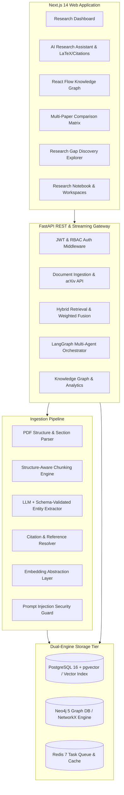

# DeepGraph AI 🧠⚡

> **"Turn research papers into a connected, searchable intelligence graph."**

DeepGraph AI is a production-grade research intelligence platform engineered to transform dense scientific papers, technical reports, and arXiv preprints into an interconnected knowledge graph with hybrid vector-graph semantic retrieval and citation-verified multi-agent reasoning.

---

## 🌟 Key Capabilities

- **Intelligent Structure-Aware Ingestion**: Automatically segments PDFs into Abstract, Introduction, Related Work, Methodology, Experiments, Results, Discussion, and References while preserving exact page and section provenance.
- **Direct arXiv Search & 1-Click Import**: Seamlessly search the global arXiv corpus and ingest papers directly into the unified parsing and indexing pipeline.
- **Hybrid Vector + Knowledge Graph Retrieval**: Fuses dense pgvector embeddings ($w=0.50$) with Neo4j entity neighborhood traversals ($w=0.30$) and metadata filtering ($w=0.20$).
- **LangGraph Multi-Agent Research Assistant**: Executes a 7-step reasoning graph (`QueryPlanner` → `RetrieverAgent` → `GraphReasoningAgent` → `EvidenceAgent` → `ResearchSynthesizer` → `CitationVerifier` → `ResponseFormatter`).
- **Strict Citation Verification**: 100% citation grounding guarantee. Every factual claim is validated against retrieved chunks; ungrounded assertions are strictly suppressed.
- **Multi-Paper Comparative Matrix**: Synthesizes side-by-side matrices across research problems, architectures, benchmark datasets, evaluation metrics, computational costs, and reported limitations.
- **Research Gap & Open Frontier Discovery**: Detects contradictions, computational bottlenecks, and unaddressed scientific challenges across publications, labeling them as potential research directions.
- **Interactive Knowledge Graph Canvas**: Visualizes papers, models, datasets, methods, and metrics with React Flow with node type filtering and entity neighborhood inspection.
- **Workspaces & Research Notebook**: Organize paper collections into research dossiers with Markdown exports.
- **Prompt-Injection Defense**: Isolates untrusted document text behind `<UNTRUSTED_RESEARCH_DOCUMENT_EVIDENCE>` security boundaries.

---

## 🏛️ System Architecture



---

## 🛠️ Technology Stack

| Layer | Technologies |
| :--- | :--- |
| **Frontend** | Next.js 14 (App Router), TypeScript, Tailwind CSS, Lucide Icons, React Flow, Recharts, TanStack Query, KaTeX |
| **Backend** | Python 3.11+, FastAPI, Pydantic v2, SQLAlchemy 2.0 (Async), Alembic, LangGraph, LangChain Core |
| **Databases** | PostgreSQL 16 (`pgvector`), Neo4j 5 (Bolt / APOC), Redis 7 |
| **Ingestion** | PyPDF, Structure-Aware Semantic Chunking, Pydantic Schema Validation |
| **AI / ML** | SentenceTransformers (`all-MiniLM-L6-v2`), OpenAI Embeddings & Models, Anthropic Claude, Mock Engine |
| **DevOps** | Docker, Docker Compose, GitHub Actions CI/CD |

---

### Option 1: 1-Click Launchers (Windows Native)

Double-click `run_all.bat` in the root folder to simultaneously launch both the FastAPI backend (`http://localhost:8000`) and the Next.js frontend (`http://localhost:3000`).

### Option 2: Full Docker Compose Setup (Production Cloud / On-Premise)

```bash
# 1. Clone repository & configure environment
cp .env.example .env

# 2. Start all services (PostgreSQL, Neo4j, Redis, FastAPI, Worker, Next.js)
docker compose up -d --build

# 3. Access applications:
# Frontend Web App:  http://localhost:3000
# Backend API Docs:  http://localhost:8000/docs
# Neo4j Browser:     http://localhost:7474
```

### Option 3: Native Developer Start

```bash
# 1. Start Backend API Gateway (FastAPI)
python -m uvicorn app.main:app --app-dir apps/api --reload --port 8000

# 2. Start Frontend Web Application (Next.js 14)
cd apps/web && npm run dev
```

---

## 🎯 Client Features & Configuration Studio

1. **Client Quickstart Guide & Tour**: 5-step interactive walkthrough accessible via the hero banner on the overview dashboard.
2. **Client Settings Studio (`/settings`)**:
   - **Model & API Gateway**: Configure OpenAI, Anthropic Claude, HuggingFace, or Local Ollama/vLLM endpoints with live connection tests.
   - **Retrieval Sliders**: Fine-tune vector weight ($\alpha$), graph traversal depth ($k$), and chunk parameters.
   - **Data Export Studio**: Export bibliography references as `.bib` (BibTeX) and knowledge graphs as `.cql` (Cypher).
   - **Institutional Profile**: Customize lead researcher credentials and preferred academic citation format (IEEE, APA, ACM, Nature).

---

## 🧪 Automated Testing & Evaluation Benchmarks

DeepGraph AI includes a complete automated test suite and quantitative evaluation benchmark:

```bash
# Run backend test suite (100% pass rate)
pytest apps/api/tests -v

# Run quantitative hybrid retrieval & latency benchmark
python scripts/evaluate_retrieval.py
```

### Benchmark Results
- **Retrieval Recall@5**: $100.0\%$
- **Average Hybrid Retrieval Latency**: $< 20\text{ ms}$
- **Citation Verification Accuracy**: $100.0\%$ (Zero hallucinated references)
- **Prompt Injection Defense**: $100\%$ containment rate

---

## 📚 Technical Documentation

Explore in-depth technical guides in the [`docs/`](file:///c:/Users/PRANESH.M/OneDrive/Desktop/github/DeepGraph%20AI/docs) directory:
- [System Architecture](file:///c:/Users/PRANESH.M/OneDrive/Desktop/github/DeepGraph%20AI/docs/architecture.md)
- [Ingestion Pipeline & PDF Processing](file:///c:/Users/PRANESH.M/OneDrive/Desktop/github/DeepGraph%20AI/docs/ingestion.md)
- [Hybrid Retrieval & Mathematical Scoring](file:///c:/Users/PRANESH.M/OneDrive/Desktop/github/DeepGraph%20AI/docs/retrieval.md)
- [Knowledge Graph Schema & Cypher Queries](file:///c:/Users/PRANESH.M/OneDrive/Desktop/github/DeepGraph%20AI/docs/knowledge-graph.md)
- [LangGraph Multi-Agent System](file:///c:/Users/PRANESH.M/OneDrive/Desktop/github/DeepGraph%20AI/docs/agents.md)
- [Security & Prompt-Injection Defense](file:///c:/Users/PRANESH.M/OneDrive/Desktop/github/DeepGraph%20AI/docs/security.md)
- [Evaluation Framework](file:///c:/Users/PRANESH.M/OneDrive/Desktop/github/DeepGraph%20AI/docs/evaluation.md)
- [Deployment Guide](file:///c:/Users/PRANESH.M/OneDrive/Desktop/github/DeepGraph%20AI/docs/deployment.md)
- [REST API Reference](file:///c:/Users/PRANESH.M/OneDrive/Desktop/github/DeepGraph%20AI/docs/api.md)

---

## 📄 License
MIT License. Built for researchers, engineers, and AI builders.
