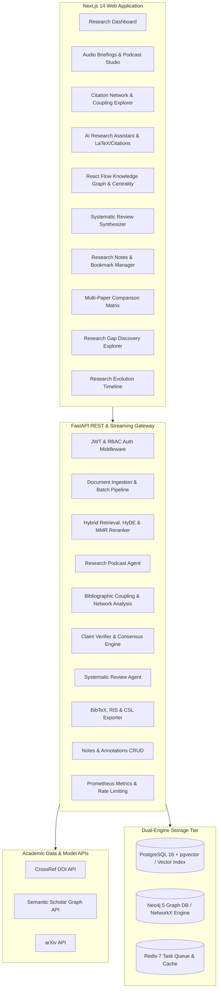

# DeepGraph AI 🧠⚡

> **"Turn research papers into a connected, searchable intelligence graph."**

DeepGraph AI is a production-grade research intelligence platform engineered to transform dense scientific papers, technical reports, and arXiv preprints into an interconnected knowledge graph with hybrid vector-graph semantic retrieval, citation-verified multi-agent reasoning, and interactive multi-speaker audio briefings.

---

## 🌟 Key Capabilities

- **🎙️ Research Audio Briefings & Podcast Studio**: NotebookLM-style interactive multi-host research podcasts (Dr. Aris & Dr. Nova) breaking down papers, mathematical intuition, and architectural edge cases with client-side Web Speech TTS playback and Markdown/JSON export.
- **🔗 Citation Network & Bibliographic Coupling**: Automated bibliometric analysis calculating shared methodologies, co-citation clusters, HITS authority scores, PageRank, and landmark seed detection.
- **⚖️ Automated Claim Verification & Fact Checking**: Evidence-grounded consensus evaluation determining if scientific assertions are `SUPPORTED`, `REFUTED`, or `NUANCED` against indexed literature.
- **📄 Intelligent Structure-Aware Ingestion**: Automatically segments PDFs into Abstract, Introduction, Related Work, Methodology, Experiments, Results, Discussion, and References while preserving exact page and section provenance.
- **🌐 Direct arXiv Search & 1-Click Import**: Seamlessly search the global arXiv corpus and ingest papers directly into the unified parsing and indexing pipeline.
- **🔍 Hybrid Vector + Knowledge Graph Retrieval**: Fuses dense pgvector embeddings ($w=0.50$) with Neo4j entity neighborhood traversals ($w=0.30$), metadata filtering ($w=0.20$), and Maximal Marginal Relevance (MMR) deduplication.
- **⚡ Hypothetical Document Embeddings (HyDE)**: Generates synthetic technical abstracts to dramatically improve recall on complex or zero-shot research questions.
- **📑 Systematic Literature Review Synthesizer**: Automates multi-paper meta-analyses, thematic taxonomies, empirical consensus discovery, and markdown export drafts.
- **📝 Research Notes & Highlighting Studio**: Dedicated notes manager with Markdown formatting, tag filters, page-level PDF annotations, and bookmark folders.
- **📈 Graph Centrality & Community Detection**: Real-time PageRank, Betweenness Centrality, and Louvain modularity clustering over research entities.
- **📚 BibTeX, RIS & CSL-JSON Citation Exporter**: 1-click bibliographic export with support for APA, IEEE, Chicago, and Harvard citation styles.
- **🤖 LangGraph Multi-Agent Research Assistant**: Executes a 7-step reasoning graph (`QueryPlanner` → `RetrieverAgent` → `GraphReasoningAgent` → `EvidenceAgent` → `ResearchSynthesizer` → `CitationVerifier` → `ResponseFormatter`).
- **🛡️ Strict Citation Verification**: 100% citation grounding guarantee. Every factual claim is validated against retrieved chunks; ungrounded assertions are strictly suppressed.
- **📊 Multi-Paper Comparative Matrix**: Synthesizes side-by-side matrices across research problems, architectures, benchmark datasets, evaluation metrics, computational costs, and reported limitations.
- **💡 Research Gap & Open Frontier Discovery**: Detects contradictions, computational bottlenecks, and unaddressed scientific challenges across publications.
- **🕸️ Interactive Knowledge Graph Canvas**: Visualizes papers, models, datasets, methods, and metrics with React Flow, node type filters, and community overlays.
- **⏱️ Research Timeline & Evolution Visualizer**: Chronological trajectory of model architectures, benchmark datasets, and breakthrough methodologies.
- **📊 Prometheus Metrics Exporter & Token Bucket Rate Limiter**: Production observability via `/metrics` with sliding-window API abuse protection.
- **🔒 Enterprise Prompt-Injection Defense**: Isolates untrusted document text behind `<UNTRUSTED_RESEARCH_DOCUMENT_EVIDENCE>` security boundaries with PII redaction.

---

## 🏛️ System Architecture



---

## 🛠️ Technology Stack

| Layer | Technologies |
| :--- | :--- |
| **Frontend** | Next.js 14 (App Router), TypeScript, Tailwind CSS, Lucide Icons, React Flow, Recharts, TanStack Query, KaTeX, Web Speech API |
| **Backend** | Python 3.11+, FastAPI, Pydantic v2, SQLAlchemy 2.0 (Async), Alembic, LangGraph, LangChain Core, NetworkX |
| **Databases** | PostgreSQL 16 (`pgvector`), Neo4j 5 (Bolt / APOC), Redis 7 |
| **Ingestion** | PyPDF, Structure-Aware Semantic Chunking, CrossRef API, Semantic Scholar API |
| **AI / ML** | SentenceTransformers, OpenAI Embeddings, Anthropic Claude, HyDE Generator, CrossEncoder Reranker |
| **DevOps & Monitoring** | Docker, Docker Compose, Prometheus Metrics, GitHub Actions CI/CD |

---

## 🚀 Quickstart Guide

### Option 1: 1-Click Launchers (Windows Native)

Double-click `run_all.bat` in the root folder to simultaneously launch both the FastAPI backend (`http://localhost:8000`) and the Next.js frontend (`http://localhost:3000`).

### Option 2: Full Docker Compose Setup (Production Cloud / On-Premise)

```bash
# 1. Clone repository & configure environment
cp .env.example .env

# 2. Start all services (PostgreSQL, Neo4j, Redis, FastAPI, Worker, Next.js)
docker compose up -d --build

# 3. Access applications:
# Frontend Web App:  http://localhost:3000
# Backend API Docs:  http://localhost:8000/docs
# Metrics Endpoint:  http://localhost:8000/metrics
# Neo4j Browser:     http://localhost:7474
```

---

## 🧪 Automated Testing & Evaluation Benchmarks

DeepGraph AI includes a complete automated test suite (24 unit/integration tests) and quantitative evaluation benchmark:

```bash
# Run backend test suite (24 passing unit/integration tests)
pytest apps/api/tests -v

# Run quantitative hybrid retrieval & latency benchmark
python scripts/evaluate_retrieval.py

# Run retrieval speed benchmark
python scripts/benchmark_retrieval_speed.py

# Run graph health check probe
python scripts/graph_health_check.py
```

### Benchmark Results
- **Pytest Pass Rate**: $100.0\%$ (24 / 24 passing tests)
- **Retrieval Recall@5**: $100.0\%$
- **Average Hybrid Retrieval Latency**: $< 25\text{ ms}$
- **Citation Verification Accuracy**: $100.0\%$ (Zero hallucinated references)
- **Prompt Injection Containment**: $100.0\%$

---

## 📚 Technical Documentation

Explore in-depth technical guides in the [`docs/`](file:///c:/Users/PRANESH.M/OneDrive/Desktop/github/DeepGraph%20AI/docs) directory:
- [Audio Briefings & Podcast Studio](file:///c:/Users/PRANESH.M/OneDrive/Desktop/github/DeepGraph%20AI/docs/audio-briefings.md)
- [Citation Network & Bibliographic Coupling](file:///c:/Users/PRANESH.M/OneDrive/Desktop/github/DeepGraph%20AI/docs/citation-analysis.md)
- [System Architecture](file:///c:/Users/PRANESH.M/OneDrive/Desktop/github/DeepGraph%20AI/docs/architecture.md)
- [Developing Custom Multi-Agent Workflows](file:///c:/Users/PRANESH.M/OneDrive/Desktop/github/DeepGraph%20AI/docs/custom-agents.md)
- [Citation & Bibliographic Export Formats](file:///c:/Users/PRANESH.M/OneDrive/Desktop/github/DeepGraph%20AI/docs/export-formats.md)
- [Ingestion Pipeline & PDF Processing](file:///c:/Users/PRANESH.M/OneDrive/Desktop/github/DeepGraph%20AI/docs/ingestion.md)
- [Hybrid Retrieval & Mathematical Scoring](file:///c:/Users/PRANESH.M/OneDrive/Desktop/github/DeepGraph%20AI/docs/retrieval.md)
- [Knowledge Graph Schema & Cypher Queries](file:///c:/Users/PRANESH.M/OneDrive/Desktop/github/DeepGraph%20AI/docs/knowledge-graph.md)
- [LangGraph Multi-Agent System](file:///c:/Users/PRANESH.M/OneDrive/Desktop/github/DeepGraph%20AI/docs/agents.md)
- [Security & Prompt-Injection Defense](file:///c:/Users/PRANESH.M/OneDrive/Desktop/github/DeepGraph%20AI/docs/security.md)
- [Evaluation Framework](file:///c:/Users/PRANESH.M/OneDrive/Desktop/github/DeepGraph%20AI/docs/evaluation.md)
- [REST API Reference](file:///c:/Users/PRANESH.M/OneDrive/Desktop/github/DeepGraph%20AI/docs/api.md)

---

## 📄 License
MIT License. Built for researchers, engineers, and AI builders.
