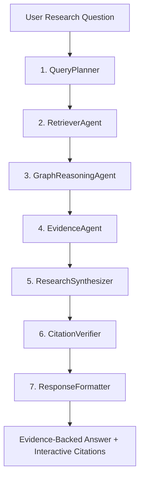

# LangGraph Multi-Agent Research System

DeepGraph AI organizes research synthesis through a 7-node LangGraph execution state graph:

## Agent Roles & Responsibilities

1. **QueryPlanner**:
   - Deconstructs user query into research sub-topics.
   - Identifies if the query requires multi-paper comparison, empirical metrics, or limitation discovery.

2. **RetrieverAgent**:
   - Executes parallel hybrid retrieval across pgvector / vector store and knowledge graph entities.
   - Applies weighted score fusion.

3. **GraphReasoningAgent**:
   - Traverses 1-hop and 2-hop entity connections to correlate shared methods, common datasets, and citation networks.

4. **EvidenceAgent**:
   - Filters candidate passages, removes redundant text, and isolates evidence blocks with strict provenance tags.

5. **ResearchSynthesizer**:
   - Generates in-depth technical response distinguishing **Direct Evidence**, **Inference**, and **Open Questions**.

6. **CitationVerifier**:
   - Strictly validates that every factual claim matches an extracted chunk ID, page number, and section header.
   - Drops or flags ungrounded claims.

7. **ResponseFormatter**:
   - Formats response with Markdown headings, KaTeX LaTeX math formulas, code blocks, and interactive `<CitationBadge />` components.
