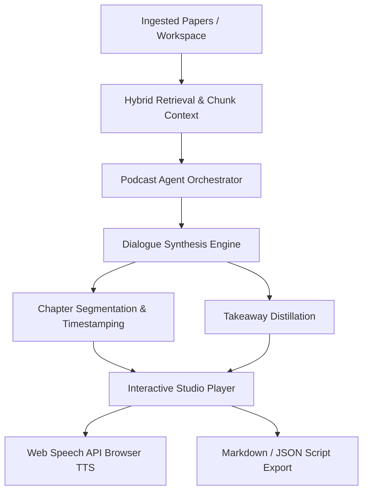

# AI Research Audio Briefings & Podcast Studio ("Research Deep Dive")

The **DeepGraph Audio Briefings Engine** generates NotebookLM-style conversational multi-host research podcasts and interactive audio briefings directly from ingested research papers, citation graphs, and literature workspaces.

---

## 🎙️ Overview

Researchers often need to absorb dense mathematical architectures, benchmark trade-offs, and empirical findings rapidly. DeepGraph AI automates script synthesis between two AI research personae:

1. **Dr. Aris (Lead Research Host)**:
   - Sets high-level motivation and problem framing.
   - Translates complex mathematical abstractions into intuitive visual analogies.
   - Bridges connections across adjacent domains and methodologies.

2. **Dr. Nova (Principal Scientist & Critic)**:
   - Deep-dives into loss formulations, layer dynamics, and inductive biases.
   - Evaluates asymptotic computational complexity ($\mathcal{O}(N^2)$ vs $\mathcal{O}(N)$).
   - Identifies empirical failure modes, dataset scale dependencies, and open limitations.

---

## 🏗️ Architecture & Pipeline



---

## ⚙️ REST API Endpoints

### 1. `POST /api/v1/podcast/generate`
Generates a structured multi-turn podcast script.

**Request Payload**:
```json
{
  "topic": "Vision Transformers vs Convolutional Networks: Inductive Bias Trade-offs",
  "style": "debate",
  "duration_target_minutes": 5,
  "paper_ids": ["paper-uuid-1", "paper-uuid-2"]
}
```

**Response**:
```json
{
  "episode_id": "9f38e018-8f81-42cb-b1b0-2bb80b7e2c69",
  "title": "Deep Dive: Vision Transformers vs Convolutional Networks",
  "subtitle": "An interactive technical discussion hosted by Dr. Aris & Dr. Nova",
  "total_duration_estimate_seconds": 345,
  "chapters": [
    {
      "title": "1. The Problem Framing & Motivation",
      "start_seconds": 0.0,
      "start_formatted": "00:00",
      "summary": "Introduction to inductive biases and scaling limits."
    }
  ],
  "dialogue": [
    {
      "turn_id": 1,
      "speaker": "Dr. Aris",
      "speaker_title": "Senior Research Host",
      "text": "Welcome back to DeepGraph Research Briefings...",
      "timestamp_formatted": "00:00",
      "timestamp_seconds": 0.0,
      "tone": "enthusiastic",
      "citations": ["An Image is Worth 16x16 Words"]
    }
  ],
  "key_takeaways": [
    "Global self-attention replaces local inductive biases, trading sample efficiency for unbounded scaling potential."
  ]
}
```

### 2. `GET /api/v1/podcast/presets`
Returns pre-configured briefing templates for rapid exploration.

---

## 🔊 Interactive Web Player Features

- **Real-time Dual Host Highlighting**: Animated avatar cards with audio pulse rings indicating the active speaker.
- **Web Speech Synthesis**: Pitch-differentiated client-side text-to-speech for distinct speaker personalities.
- **Variable Playback Speed**: 1.0x, 1.25x, 1.5x speed multiplier toggles.
- **Chapter Navigation**: One-click jumps to specific analytical sections.
- **Script Export**: Instant copy or markdown download for offline reading.
