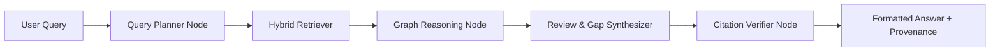

# Developing Custom Multi-Agent Workflows in DeepGraph AI

DeepGraph AI features a modular, stateful multi-agent system built on deterministic directed graphs and asynchronous provider abstractions.

## Agent Architecture

Agents communicate over a shared immutable state dictionary passed through pipeline nodes:



## Adding a Custom Agent

To implement a new specialized reasoning agent (e.g., Clinical Trial Evaluator or Proof Assistant):

1. **Subclass Base Agent or Define Class**:
```python
from app.agents.llm_provider import llm_service
from app.retrieval.hybrid_retriever import hybrid_retriever

class HypothesisVerificationAgent:
    async def verify_hypothesis(self, session, hypothesis: str) -> dict:
        evidence = await hybrid_retriever.retrieve(session=session, query=hypothesis, top_k=5)
        prompt = f"Evaluate empirical evidence for hypothesis: {hypothesis}\nEvidence:\n{evidence}"
        verdict = await llm_service.generate_text(prompt)
        return {"hypothesis": hypothesis, "verdict": verdict, "evidence": evidence.results}
```

2. **Register API Router**:
Add an endpoint in `app/api/v1/endpoints/` and mount it inside `app/api/v1/api.py`.

3. **Frontend Integration**:
Create a service function in `apps/web/services/` and render interactive widgets in `apps/web/app/(dashboard)/`.
