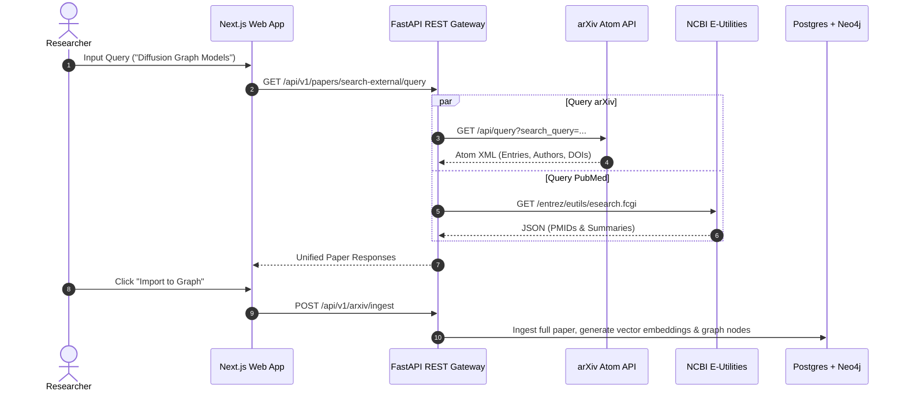

# Live Literature Discovery, Methodology Extraction & LaTeX Studio

DeepGraph AI integrates external academic repositories (arXiv & PubMed) with deterministic heuristic extractors and LaTeX paper draft synthesizers.

## 1. Live Academic Search Architecture

The `LivePaperFetcher` enables real-time preprint querying without requiring local PDF pre-download:

## 2. Methodology Extraction Pipeline

The `MethodologyExtractorAgent` parses scientific literature across 6 standardized dimensions:
- **Benchmark Datasets**: Name, domain, size description, train/val/test splits.
- **Comparative Baselines**: Baseline architectures and predecessor SOTA models.
- **Evaluation Metrics**: Specific scores (Accuracy, F1, Latency, Peak VRAM) and relative baseline gains.
- **Hardware & Compute**: GPU accelerators, total training GPU hours, distributed strategy (FSDP, FlashAttention-3).
- **Hyperparameters**: Optimizer parameters (AdamW, beta1, beta2, learning rate schedule, effective batch size).
- **Reported Limitations**: Critical edge cases, dataset assumptions, memory trade-offs.

## 3. LaTeX Synthesis & Export Studio

The `LatexSummaryGeneratorAgent` converts selected corpus papers into compile-ready `.tex` documents:
- Automatic `\cite{...}` key generation based on author surname and publication year.
- Dynamic generation of `\begin{table*} ... \end{table*}` empirical taxonomy matrices.
- Companion `.bib` export compatible with Overleaf, Zotero, and Mendeley.

## 4. Reciprocal Rank Fusion (RRF) Reranking

Combines dense semantic vector search with BM25 keyword matching and graph entity linkages:

$$RRF(d) = \sum_{r \in R} \frac{1}{k + rank(r, d)}$$

where $k = 60$. RRF eliminates score scale disparities between cosine similarities and BM25 scores, producing calibrated consensus retrieval.
