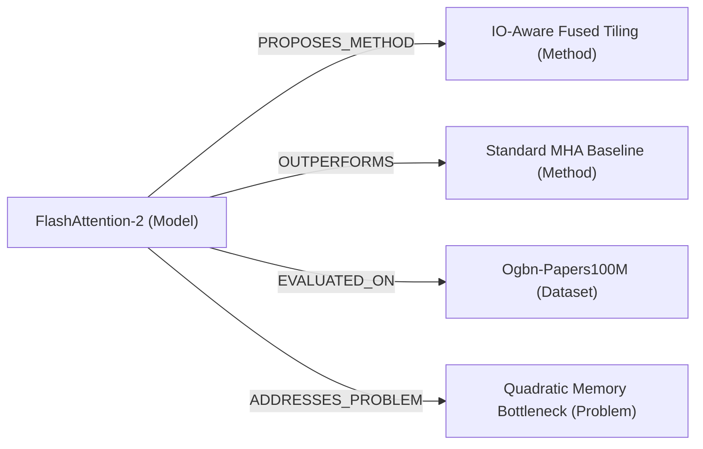

# Meta-Analysis Synthesis & Knowledge Graph Triplets

DeepGraph AI includes mathematical tools for statistical literature synthesis (Meta-Analyses, Forest Plots) and typed relational ontology extraction (Knowledge Graph Triplets).

---

## 1. Statistical Meta-Analysis & Forest Plots

### 1.1 Inverse-Variance Weighting Formulation
Given $k$ independent scientific studies with standardized effect sizes $d_i$ and standard errors $SE_i$, each study is assigned an inverse-variance weight $w_i$:

$$w_i = \frac{1}{SE_i^2}$$

The pooled fixed-effect estimate $\bar{\theta}_{\text{fixed}}$ is computed as:

$$\bar{\theta}_{\text{fixed}} = \frac{\sum_{i=1}^{k} w_i d_i}{\sum_{i=1}^{k} w_i}$$

The standard error of the pooled effect $SE_{\text{pooled}}$ and $95\%$ Confidence Interval are:

$$SE_{\text{pooled}} = \sqrt{\frac{1}{\sum_{i=1}^{k} w_i}}, \quad 95\%\text{ CI} = \left[ \bar{\theta} - 1.96 \times SE_{\text{pooled}}, \; \bar{\theta} + 1.96 \times SE_{\text{pooled}} \right]$$

### 1.2 Cochran's $Q$ and Higgins $I^2$ Heterogeneity Index
Heterogeneity assesses whether variance across study effect sizes exceeds expected random sampling error:

$$Q = \sum_{i=1}^{k} w_i \left( d_i - \bar{\theta}_{\text{fixed}} \right)^2, \quad df = k - 1$$

$$I^2 = \max\left(0, \frac{Q - df}{Q}\right) \times 100\%$$

- **$I^2 < 30\%$**: Low Heterogeneity (High consistency across empirical benchmarks).
- **$30\% \le I^2 \le 60\%$**: Moderate Heterogeneity.
- **$I^2 > 60\%$**: Substantial Heterogeneity (Effects depend strongly on specific hyperparameters or dataset distributions).

---

## 2. Knowledge Graph Triplets & Predicates

The `SemanticTripletExtractor` constructs typed relational facts from scientific claims:

### Core Predicate Ontology
1. `PROPOSES_METHOD`: Author introduces a novel algorithm, loss function, or neural architecture.
2. `EVALUATED_ON`: Benchmark dataset, leaderboard, or domain testbed evaluated in the paper.
3. `OUTPERFORMS`: Statistical superiority over comparative baselines or prior SOTA models.
4. `ADDRESSES_PROBLEM`: Mitigation of identified research gaps, bottlenecks, or trade-offs.
5. `EXTENDS_ARCHITECTURE`: Methodological building upon foundational seed papers.

---

## 3. Peer Review Rubric & Evaluation Criteria

| Evaluation Dimension | Weight | Scoring Criteria |
| :--- | :--- | :--- |
| **Originality & Novelty** | 25% | Conceptual paradigm shift, non-trivial formulation |
| **Empirical Soundness** | 30% | Statistically validated benchmarks, baseline fairness, error bars |
| **Clarity & Structure** | 15% | Organization, mathematical rigor, clean visual figures |
| **Significance & Impact** | 15% | Practical applicability and advancement to scientific community |
| **Reproducibility & Code** | 15% | Public repositories, containerized environments, open checkpoints |
