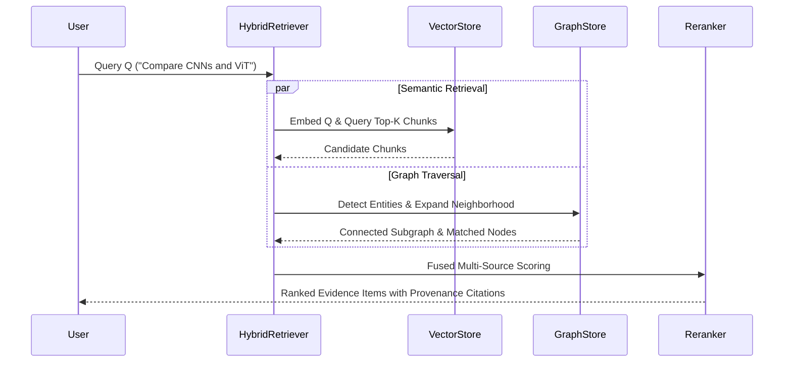

# Hybrid Retrieval & Semantic Search

DeepGraph AI implements a multi-channel **Hybrid Retriever** fusing dense vector semantic search, knowledge graph entity traversals, and document metadata filters.

## Mathematical Fusion Scoring Formula

When a user submits a research query $Q$, the retrieval engine calculates:

$$\text{Final Score}(C) = w_{\text{vec}} \cdot S_{\text{semantic}}(Q, C) + w_{\text{graph}} \cdot S_{\text{graph}}(Q, C) + w_{\text{meta}} \cdot S_{\text{meta}}(Q, C)$$

Where:
- $S_{\text{semantic}}(Q, C) = \frac{\mathbf{v}_Q \cdot \mathbf{v}_C}{\|\mathbf{v}_Q\| \|\mathbf{v}_C\|}$ is the cosine similarity between the query embedding and the chunk embedding.
- $S_{\text{graph}}(Q, C)$ evaluates knowledge graph entity overlap and neighborhood proximity.
- $S_{\text{meta}}(Q, C)$ measures exact matches across authors, publication years, and venue metadata.
- Configurable default weights: $w_{\text{vec}} = 0.50$, $w_{\text{graph}} = 0.30$, $w_{\text{meta}} = 0.20$.

## Retrieval Execution Flow

